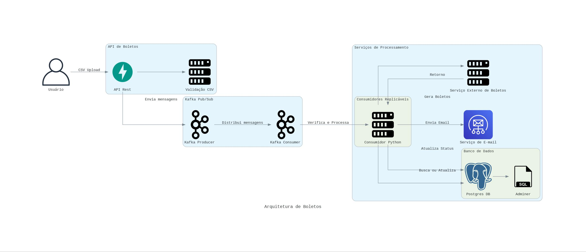

# Bankslips API - Processamento Assíncrono com Kafka

## Descrição

Este repositório ([mabittar/bankslips](https://github.com/mabittar/bankslips)) contém uma aplicação para o processamento de boletos utilizando uma arquitetura assíncrona baseada em Kafka. A aplicação recebe arquivos CSV contendo informações de boletos, valida os dados e utiliza Kafka para processamento em segundo plano. Ela também faz chamadas a serviços externos (mock) para geração de boletos e envio de e-mails, com persistência em um banco de dados PostgreSQL.

## Arquitetura

A solução utiliza os seguintes componentes:

1. **API de Boletos (FastAPI)**: Recebe arquivos CSV via o endpoint `/bankslip/batch`, valida e segmenta os dados em blocos de 1000 registros, e publica mensagens no Kafka.

2. **Kafka**: Atua como sistema de mensageria Pub/Sub para comunicação assíncrona entre a API e os consumidores.

3. **Consumidor Kafka (Python)**: Consome mensagens do Kafka, verifica se o boleto já foi processado no banco de dados e, se não, chama serviços externos para geração de boletos e envio de e-mails.

4. **Banco de Dados (PostgreSQL)**: Armazena informações sobre os boletos processados e seus status.

5. **Adminer**: Interface web para gerenciamento do banco de dados PostgreSQL.

6. **Kafka-UI**: Interface web para monitoramento e gerenciamento do Kafka.

## Diagrama de Arquitetura



essa imagem foi gerada a partir do arquivo `diagrams.py`

## Fluxo de Trabalho

1. O **Usuário** faz upload de um arquivo CSV contendo informações dos boletos via o endpoint `/bankslip/batch`.

2. A **API** faz uma primeira validação do arquivo, segmenta em blocos de 1000 linhas e publica as mensagens no Kafka. As linhas que não estão em acordo, são devolvidas para o usuário no retorno da resposta.

    2.1 A api também possui um endpoint para verifição (GET) e criação unitária de cobranças (POST) ambos em `/bankslip`

3. O **Consumidor Kafka** consome as mensagens e, para cada uma:

   - Verifica no **PostgreSQL** se o boleto já foi processado.
   - Caso não exista, faz uma requisição ao **Serviço Externo de Geração de Boletos**.
   - Após receber o boleto, faz uma requisição ao **Serviço Externo de Envio de E-mails**.
   - Atualiza o status do processamento no banco de dados.

4. O **Adminer** e o **Kafka-UI** são utilizados para gerenciamento e monitoramento dos sistemas.

## Tecnologias Utilizadas

- **Python**: Linguagem de programação principal.

- **FastAPI**: Framework web para construção da API REST.

- **Kafka**: Plataforma de streaming distribuída para comunicação assíncrona.

- **PostgreSQL**: Banco de dados relacional.

- **Docker** e **Docker Compose**: Para containerização e orquestração dos serviços.

- **Adminer**: Interface de gerenciamento do banco de dados PostgreSQL.

- **Kafka-UI**: Interface para monitoramento do Kafka.

## Pré-requisitos

- **Docker** e **Docker Compose** instalados.

- **Python 3.11+** instalado (caso queira executar localmente sem Docker).

- Arquivo `.env` configurado com as variáveis de ambiente necessárias.

## Configuração do Ambiente

Para facilitar a configuração do ambiente, há um arquivo `Makefile` disponível. Os comandos abaixo assumem que você está na raiz do projeto.

### Passos

1. **Clone o repositório:**

   ```bash
   git clone https://github.com/mabittar/bankslips.git
   cd bankslips
    ```

2. **Configure as variáveis de ambiente:**

Crie um arquivo `.env` na raiz do projeto com as seguintes variáveis (exemplo):

```
KAFKA_BOOTSTRAP_SERVERS="localhost:9093"
POSTGRES_SERVER="localhost"
POSTGRES_PASSWORD="changethis"
POSTGRES_USER="admin"
POSTGRES_DB="bankslip"
POSTGRES_PORT="5432"
POSTGRES_DRIVER="psycopg"
```

3. **Construir e iniciar os serviços:**

Utilize o Makefile para configurar e iniciar o ambiente:

Limpar containers ativos:

```bash
make clean
```

Subir os serviços com Docker Compose:

```bash
make up

```

4. **Acessar os serviços:**

- API FastAPI: <http://localhost:8000/docs>
- Adminer: <http://localhost:8080>
- Kafka-UI: <http://localhost:8081>


4.1 **Criando a tabela no banco de dados**

Acesso o serviço Adminer, através da URL informada acima.

Para login utilize as seguintes informações:

```text
System: PostgreSQL
Server: db
Username: admin
Password: changethis
Database: bankslip

```

Acesse o menu `SQL Command`, no painel esquerdo e execute o scritp que está em create_table.sql na raíz desse repositório.

## Uso da API

### Endpoint para Upload de CSV

- URL: `/bankslip/batch`
- Método: POST
- Descrição: Recebe um arquivo CSV com informações dos boletos para processamento.

Exemplo de Requisição

> *Antes de fazer a requisição garanta que a tabela bankslip exista no banco de dados*

```bash
curl -X POST "http://localhost:8000/bankslip/batch" \
  -H "Content-Type: multipart/form-data" \
  -F "file=@/caminho/para/seu/arquivo.csv"
```

### Monitoramento e Gerenciamento

- Adminer: Utilize para gerenciar e visualizar o banco de dados PostgreSQL.
- Kafka-UI: Utilize para monitorar tópicos, mensagens e status do Kafka.

### Testes

Para executar os testes unitários e de integração:
lembres-e de ativar o ambiente virtual, por exemplo `source .venv/bin/active`

```bash
pip install -r requirements-dev.txt
pytest tests/
```

## Futuras Melhorias

- Monitoramento: Adicionar ferramentas de monitoramento e logging mais robustas.
- Tratamento de erros: Adicionar tratamento de erros refinados e mais explicativos. Assim com ooutras validações
- Autenticação e Autorização: Implementar segurança nos endpoints da API e CORS
- Escalabilidade: Otimizar o consumidor Kafka para melhor performance e escalabilidade.
- Testes: ampliar a cobertura de testes e garantir um ambiente de testes integrados.
- CI/CD: Configurar pipelines de integração e entrega contínuas.

### Ambiente Produtivo

Essa solução é uma POC. Utilizada para provar mostrar que é possível consumir um arquivo com muitas linhas de forma ágil e distribuída, mas para ambientes produtivos utilizaria uma arquitetura voltada a eventos e soluções serverless.

Um serviço autenticado para receber o arquivo e fazer as validações iniciais, que faria o envio do arquivo corrigido para uma Bucket. Uma função serverless para reagir ao evento de criação do arquivo no bucket e enviar chuncks de entradas para um PubSub e outra função serverless para escalar conforme quantidade de chuncks recebidos e realizar a atividade final.
